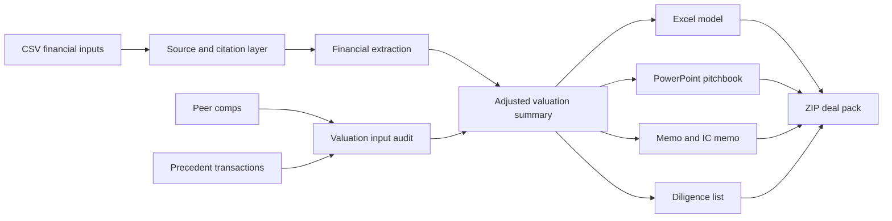

# DealForge AI — Investment Banking Analyst Copilot

**A portfolio-grade finance automation project by Mohit Bhatnagar.**

DealForge AI demonstrates how I translate an investment-banking workflow into a tested software product: structured financial inputs are validated, adjusted, and compiled into analyst work products such as valuation QA, source confidence, corrected workpapers, Excel model, PowerPoint pitchbook, investment memo, IC memo, diligence request list, consistency checks, and a checksum-verified deal-pack bundle.

> This public repository is a **portfolio-plus synthetic edition**. It is intentionally close to the visible workflow depth of the private DealForge workbench, while keeping customer-data handling, commercial integrations, private Algosphere product code, and confidential sources out of the public repository.

[](https://github.com/mohit231007/DealForge-AI-Investment-Banking-Analyst-Copilot/actions/workflows/ci.yml)


## Two-minute recruiter review

1. Run `streamlit run app.py` to view the banker-style control tower.
2. Read the [portfolio case study](docs/CASE_STUDY.md).
3. Inspect the [sample adjusted valuation summary](sample_outputs/adjusted_valuation_summary.json).
4. Read the [sample investment memo](sample_outputs/investment_memo.md).
5. Review the [architecture](docs/ARCHITECTURE.md) and [interview guide](docs/INTERVIEW_GUIDE.md).

## Why I built it

Investment teams do not only need dashboards or chatbots. They need repeatable work products with traceable assumptions, visible exclusions, review warnings, and consistent outputs across memos, models, and decks.

This project demonstrates my ability to combine:

- financial-analysis thinking;
- Python product engineering;
- Excel and PowerPoint automation;
- data validation and QA;
- analyst-friendly UX;
- auditability and human-review controls;
- public/private product-boundary thinking.

## What the portfolio-plus edition generates

```text
Synthetic company financials + peer comps + precedent transactions
                              ↓
                    Source index + citation map
                              ↓
      Financial extraction + comps + precedents + source confidence
                              ↓
          Valuation input audit + adjustment recommendations
                              ↓
  Corrected CSVs + adjusted valuation summary + consistency checks
                              ↓
   Excel model + PowerPoint pitchbook + memo + IC memo + diligence
                              ↓
               Checksum manifest + portable ZIP deal pack
```

Generated artifacts:

```text
01_company_profile.md
02_investment_memo.md
03_source_index.json
04_synthetic_document_chunks.jsonl
05_due_diligence_red_flags.md
06_audit_trail.md
07_citation_map.json
08_source_map.json
09_validation_report.json
10_valuation_model.xlsx
11_pitchbook.pptx
12_financial_extract.json
13_comps_analysis.json
14_precedent_transactions.json
15_consistency_checks.json
16_investment_committee_memo.md
17_due_diligence_request_list.md
18_source_confidence_ladder.json
19_valuation_input_audit.json
20_valuation_adjustment_recommendations.json
21_corrected_peer_comps.csv
22_corrected_precedent_transactions.csv
23_adjusted_valuation_summary.json
00_deal_pack_bundle_manifest.json
```

## Recruiter snapshot

| Capability | Evidence in this repository |
|---|---|
| Finance workflow design | Source pack, financial extract, comps, precedents, IC memo, diligence workflow |
| Valuation reasoning | Original vs adjusted multiples, excluded rows, implied EV range |
| Python engineering | Modular engine, CLI, Streamlit UI, tests, ZIP packaging |
| Office automation | Generated `.xlsx` valuation model and `.pptx` pitchbook |
| Data quality | Target self-exclusion, sector checks, outlier/NM handling, source review |
| Product thinking | Public/private product boundary and future Algosphere commercial direction |
| Communication | Memo, IC memo, diligence list, case study, interview guide |

## Architecture



## Quick start

```powershell
python -m venv .venv
.\.venv\Scripts\Activate.ps1
python -m pip install -r requirements.txt
python -m pytest
python run_demo.py
```

Run the Streamlit interface:

```powershell
streamlit run app.py
```

## Sample data

All included company, peer, and transaction names are fictional. The sample dataset is designed to demonstrate:

- target-company self-inclusion detection;
- sector mismatch exclusion;
- `NM` EBITDA handling;
- source confidence / source-verification flags;
- valuation input audit warnings;
- adjustment recommendations;
- corrected peer and precedent workpapers;
- original versus adjusted valuation medians;
- mixed transaction-unit review warnings.

The included synthetic case produces an adjusted EV range of **INR 45,000–80,000 crore** after QA exclusions. This is a workflow demonstration, not a real company valuation.

## Important limitations

- The public edition does not ingest confidential data rooms.
- It does not connect to paid market-data or transaction databases.
- It does not include private Algosphere product orchestration, security, billing, or customer-data workflows.
- It does not provide investment advice, a fairness opinion, or a certified valuation.
- Outputs are analytical starter work products and require human review.

## Documentation

- [Portfolio case study](docs/CASE_STUDY.md)
- [Technical architecture](docs/ARCHITECTURE.md)
- [Interview guide](docs/INTERVIEW_GUIDE.md)
- [Public/private product boundary](docs/PRODUCT_BOUNDARY.md)
- [Security and limitations](SECURITY.md)
- [Portfolio evaluation notice](NOTICE.md)

## About the builder

**Mohit Bhatnagar** — data science, analytics, automation, and AI product development.

This project is intended to demonstrate that I can understand a complex finance workflow, convert it into a usable product, test it aggressively, and communicate the result to both technical and business stakeholders.

---

**Portfolio demonstration only. Human review required. Not investment advice.**
