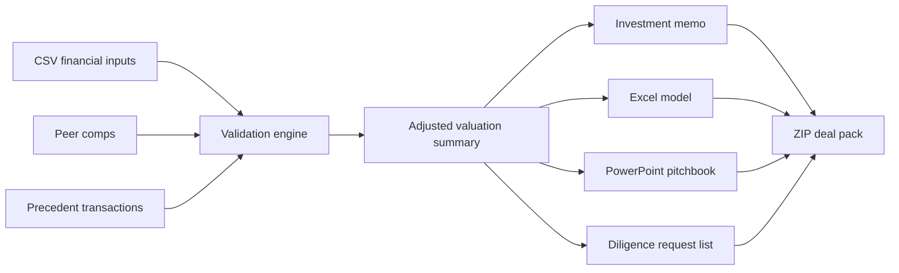

# DealForge AI — Investment Banking Analyst Copilot

**A portfolio-grade finance automation project by Mohit Bhatnagar.**

DealForge AI demonstrates how I translate an investment-banking workflow into a tested software product: structured financial inputs are validated, adjusted, and compiled into analyst work products such as a valuation summary, investment memo, due-diligence request list, Excel model, PowerPoint pitchbook, and portable deal-pack bundle.

> This public repository is a **sanitized portfolio edition** built with synthetic data. The broader commercial product is maintained privately under **The Algosphere**.

[](https://github.com/mohit231007/DealForge-AI-Investment-Banking-Analyst-Copilot/actions/workflows/ci.yml)


## Two-minute recruiter review

1. Read the [portfolio case study](docs/CASE_STUDY.md).
2. Inspect the [sample adjusted valuation summary](sample_outputs/adjusted_valuation_summary.json).
3. Read the [sample investment memo](sample_outputs/investment_memo.md).
4. Review the [architecture](docs/ARCHITECTURE.md) and [interview guide](docs/INTERVIEW_GUIDE.md).
5. Run `streamlit run app.py` for the interactive workflow.

## Why I built it

Investment teams do not only need dashboards or chatbots. They need repeatable work products with traceable assumptions, visible exclusions, review warnings, and consistent outputs across memos, models, and decks.

This project demonstrates my ability to combine:

- financial-analysis thinking;
- Python product engineering;
- Excel and PowerPoint automation;
- data validation and QA;
- analyst-friendly UX;
- auditability and human-review controls.

## What the portfolio edition generates

```text
Synthetic company financials + peer comps + precedent transactions
                              ↓
                    Input validation and QA
                              ↓
              Adjusted valuation-set construction
                              ↓
        Original vs adjusted medians and implied EV range
                              ↓
 Investment memo + diligence list + Excel + PowerPoint + ZIP bundle
```

Generated artifacts:

1. `01_company_profile.md`
2. `02_investment_memo.md`
3. `03_adjusted_valuation_summary.json`
4. `04_due_diligence_request_list.md`
5. `05_valuation_model.xlsx`
6. `06_pitchbook.pptx`
7. `07_manifest.json`
8. `dealforge_portfolio_pack.zip`

## Recruiter snapshot

| Capability | Evidence in this repository |
|---|---|
| Finance workflow design | Comparable-company and precedent-transaction QA |
| Valuation reasoning | Original vs adjusted multiples and implied EV range |
| Python engineering | Modular engine, CLI, Streamlit UI, tests |
| Office automation | Generated `.xlsx` model and `.pptx` pitchbook |
| Data quality | Target self-exclusion, sector checks, outlier/NM handling |
| Product thinking | Clear public/private product boundary and commercial roadmap |
| Communication | IC-style memo, diligence questions, architecture and case study |

## Architecture



## Quick start

```powershell
python -m venv .venv
.\.venv\Scripts\Activate.ps1
python -m pip install -r requirements.txt
python run_demo.py
```

Run the Streamlit interface:

```powershell
streamlit run app.py
```

Run tests:

```powershell
python -m pytest
```

## Sample data

All included company, peer, and transaction names are fictional. The sample dataset is designed to demonstrate:

- target-company self-inclusion detection;
- sector mismatch exclusion;
- `NM` EBITDA handling;
- original versus adjusted valuation medians;
- mixed transaction-unit review warnings;
- source-verification flags.

The included synthetic case produces an adjusted EV range of **INR 45,000–80,000 crore** after QA exclusions. This is a workflow demonstration, not a real company valuation.

## Important limitations

- The public edition does not ingest confidential data rooms.
- It does not connect to paid market-data or transaction databases.
- It does not provide investment advice, a fairness opinion, or a certified valuation.
- Outputs are analytical starter work products and require human review.
- The private Algosphere product contains a broader workflow and is not published here.

## Documentation

- [Portfolio case study](docs/CASE_STUDY.md)
- [Technical architecture](docs/ARCHITECTURE.md)
- [Interview guide](docs/INTERVIEW_GUIDE.md)
- [Public/private product boundary](docs/PRODUCT_BOUNDARY.md)
- [Security and limitations](SECURITY.md)
- [Portfolio evaluation notice](NOTICE.md)

## About the builder

**Mohit Bhatnagar** — data science, analytics, automation, and AI product development.

This project is intended to demonstrate that I can understand a complex finance workflow, convert it into a usable product, test it aggressively, and communicate the result to both technical and business stakeholders.

---

**Portfolio demonstration only. Human review required. Not investment advice.**
